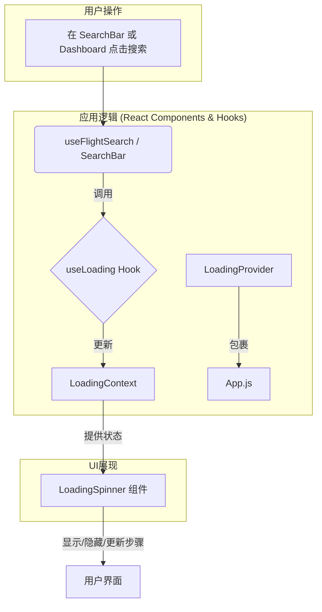

# 多步加载动画功能实施计划

## 1. 概述 (Overview)

为了提升用户在等待航班搜索结果时的体验，我们将用一个信息更丰富、交互更友好的多步加载动画，替换当前简单的“加载中”指示器。此动画将以模态框（Modal）的形式出现，展示搜索过程的多个模拟步骤，并附带一个计时器。

我们将采用**前端模拟**的策略，通过创建一个全局共享的 `LoadingContext` 和一个可复用的 `LoadingSpinner` 组件来实现。

## 2. UI/UX 设计 (UI/UX Design)

新的加载动画将是一个覆盖在页面中心的模态框，风格将沿用项目已有的“玻璃拟态”(`glassmorphism`)效果，以确保视觉统一。

**模态框构成元素:**

*   **标题**: "正在为您寻找最佳航班..."
*   **步骤列表**:
    *   每个步骤包含一个图标、步骤名称和状态。
    *   **已完成**: 显示一个绿色的“对勾”图标 (✓)。
    *   **进行中**: 显示一个旋转的加载中图标 (spinner)。
    *   **未开始**: 显示一个灰色的圆圈图标 (○)。
*   **计时器**: 在右下角显示一个从 `00:00` 开始递增的计时器，让用户感知到时间的流逝。
*   **视觉设计草图**:

```
+-----------------------------------------------------+
|                                                     |
|         正在为您寻找最佳航班...                     |
|                                                     |
|   [✓] 正在搜索航班                                  |
|   [⟳] 正在获取隐藏航班                              |
|   [○] AI正在分析                                    |
|   [○] 正在整理                                      |
|                                                     |
|                                       耗时: 00:12   |
+-----------------------------------------------------+
```

## 3. 技术方案 (Technical Plan)

我们将通过创建一个新的 React Context 来实现全局的状态管理，确保任何组件都可以方便地触发和控制这个加载动画。

**架构图 (Mermaid Diagram):**



**a. 组件结构 (Component Structure)**

1.  **`Front_end/src/contexts/LoadingContext.jsx`**:
    *   创建一个新的 React Context (`LoadingContext`)。
    *   提供一个 `LoadingProvider` 组件，它将内部管理加载状态（`isLoading`, `steps`, `currentStepIndex`, `elapsedTime`）。
    *   它将向其子组件暴露 `startLoading` 和 `stopLoading` 方法。

2.  **`Front_end/src/components/Common/LoadingSpinner.jsx`**:
    *   一个全新的、可复用的UI组件。
    *   使用 `useContext` 从 `LoadingContext` 获取状态。
    *   当 `isLoading` 为 `true` 时，使用 Material-UI 的 `<Modal>` 组件显示加载动画。
    *   根据 `steps` 和 `currentStepIndex` 渲染步骤列表。
    *   内部实现计时器逻辑。

3.  **`Front_end/src/hooks/useLoading.js`**:
    *   一个简单的自定义 Hook，`useLoading`，它封装了 `useContext(LoadingContext)`，使组件调用更简洁。

**b. 状态管理 (`LoadingContext` State)**

Context 中将包含以下状态：

*   `isLoading: boolean`: 控制模态框的显示与隐藏。
*   `steps: string[]`: 存储所有步骤的描述文本。
*   `currentStepIndex: number`: 当前活动步骤的索引。
*   `elapsedTime: number`: 已用时间（秒）。

**c. 实现逻辑 (Implementation Logic)**

1.  **启动加载 (`startLoading`)**:
    *   当用户点击搜索时，调用 `startLoading()`。
    *   此函数将 `isLoading` 设为 `true`，重置 `currentStepIndex` 和 `elapsedTime`。
    *   它会启动一个 `setInterval` 来模拟步骤的推进（例如，每10-15秒 `currentStepIndex` 加一），直到所有步骤完成或API调用结束。
    *   同时，另一个 `setInterval` 会每秒更新 `elapsedTime`。

2.  **停止加载 (`stopLoading`)**:
    *   当API调用成功或失败返回时，调用 `stopLoading()`。
    *   此函数将 `isLoading` 设为 `false`，并清除所有的 `setInterval`。

## 4. 实施步骤 (Implementation Steps)

1.  **创建 Context 和 Provider**:
    *   创建新文件 `Front_end/src/contexts/LoadingContext.jsx`。
    *   在其中定义 `LoadingContext` 和 `LoadingProvider`，并实现 `startLoading` 和 `stopLoading` 的逻辑。
    *   创建新文件 `Front_end/src/hooks/useLoading.js` 并导出 `useLoading` Hook。

2.  **创建 `LoadingSpinner` 组件**:
    *   创建新文件 `Front_end/src/components/Common/LoadingSpinner.jsx`。
    *   根据上面的UI/UX设计，使用 Material-UI 组件构建界面。

3.  **全局集成**:
    *   在 `Front_end/src/App.js` 中，用 `LoadingProvider` 包裹整个应用，并在其中渲染 `<LoadingSpinner />` 组件。

    ```javascript
    // Front_end/src/App.js
    import { LoadingProvider } from './contexts/LoadingContext';
    import LoadingSpinner from './components/Common/LoadingSpinner';

    function App() {
      return (
        <LoadingProvider>
          {/* ... a lot of other providers ... */}
          <LoadingSpinner />
          <AppRouter />
          {/* ... */}
        </LoadingProvider>
      );
    }
    ```

4.  **改造现有搜索逻辑**:
    *   **仪表盘搜索**: 修改 `Front_end/src/components/Dashboard/hooks/useFlightSearch.js`。
        *   导入 `useLoading` Hook。
        *   在 `searchFlightsForTask` 函数中，将 `setSearchLoading(true)` 替换为 `startLoading()`，将 `setSearchLoading(false)` 替换为 `stopLoading()`。
    *   **主页搜索**: 修改 `Front_end/src/components/Home/SearchBar.jsx`。
        *   导入 `useLoading` Hook。
        *   在 `fetchData` 函数中，将 `setLoading(true)` 替换为 `startLoading()`，将 `setLoading(false)` 替换为 `stopLoading()`。

5.  **添加国际化文本**:
    *   将加载步骤的文本（如 "正在搜索航班"）添加到 `Front_end/src/i18n/locales/zh/common.json` 和 `Front_end/src/i18n/locales/en/common.json` 中，以便多语言支持。